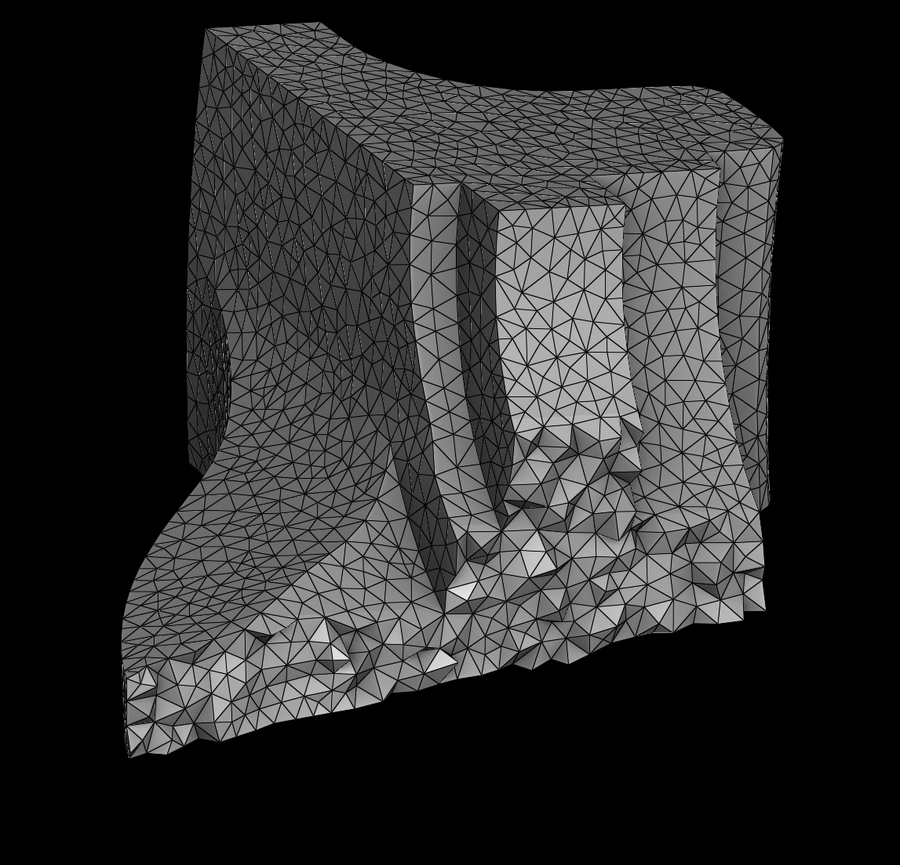
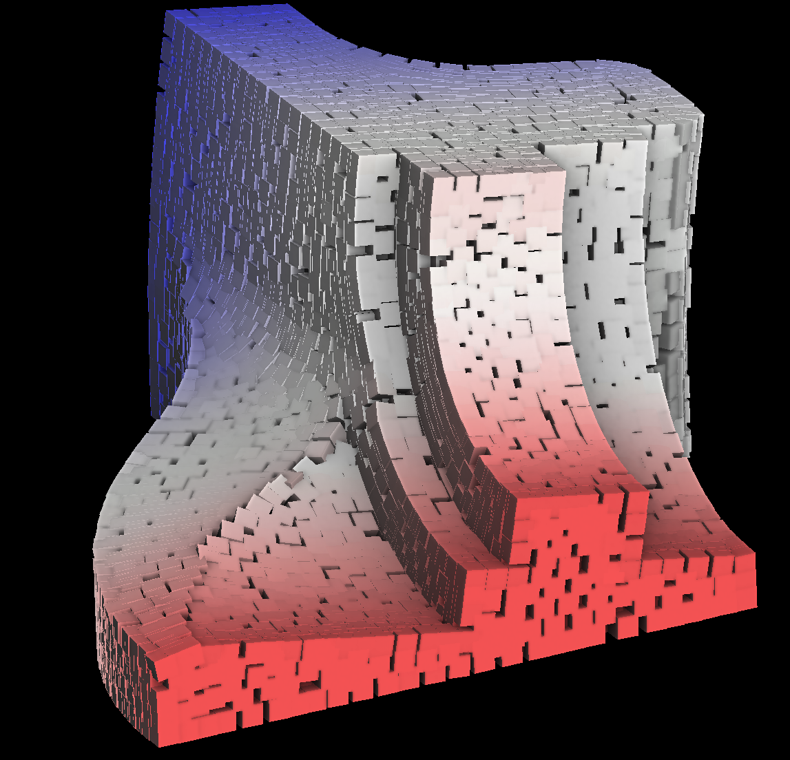
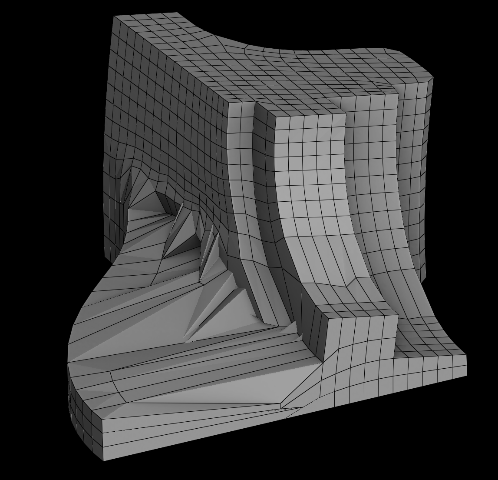

# HexFrameFlow

<table>
<tr>
<th>Input tetrahedral mesh</th>
<th>Result Frame field</th>	
<th>Result hexahedral mesh</th>
</tr>
<tr>
<td>  </td>
<td>  </td>
<td>  </td>
</tr>
</table>

This repo provides a integrated workflow for automatically generating all-hexahedral (hex) meshes from tetrahedral inputs using classic frame-field related methodologies.
This workflow integrates three key works:

- [**Practical 3D frame field generation**](https://dl.acm.org/doi/10.1145/2980179.2982408) - it is designed to generate a frame field from an input tetrahedral mesh, with the code adapted from the supplementary materials of the cited paper [[supp]](https://dl.acm.org/doi/suppl/10.1145/2980179.2982408/suppl_file/233-0220.zip).
- [**CubeCover– Parameterization of 3D Volumes**](https://onlinelibrary.wiley.com/doi/abs/10.1111/j.1467-8659.2011.02014.x) - it generates an integer-grid parametrization from an input tetrahedral mesh and its associated frame field, with the code adapted from repos [[evouga/CubeCover]](https://github.com/evouga/CubeCover) and [[the13fools/Mint3D]](https://github.com/the13fools/Mint3D).
- [**HexEx: robust hexahedral mesh extraction**](https://dl.acm.org/doi/abs/10.1145/2897824.2925976) - it robustly extracts an all-hex mesh from the input integer grid parametrization, with the code adapted from the official open-source implementation [[feengg/libHexEx]](https://github.com/feengg/libHexEx) and [[dbrandes-welfenlab/libHexExFull]](https://github.com/dbrandes-welfenlab/libHexExFull).

If you use this code in your research, please cite the following original work:

<details>
<summary>"Practical 3D frame field generation" BibTeX</summary>

```
@article{10.1145/2980179.2982408,
  author = {Ray, Nicolas and Sokolov, Dmitry and L\'{e}vy, Bruno},
  title = {Practical 3D frame field generation},
  year = {2016},
  issue_date = {November 2016},
  publisher = {Association for Computing Machinery},
  address = {New York, NY, USA},
  volume = {35},
  number = {6},
  issn = {0730-0301},
  url = {https://doi.org/10.1145/2980179.2982408},
  doi = {10.1145/2980179.2982408},
  journal = {ACM Trans. Graph.},
  month = dec,
  articleno = {233},
  numpages = {9},
  keywords = {smooth frame fields, remeshing}
}
```
</details>

<details>
<summary>"CubeCover– Parameterization of 3D Volumes" BibTeX</summary>

```
@article{https://doi.org/10.1111/j.1467-8659.2011.02014.x,
  author = {Nieser, M. and Reitebuch, U. and Polthier, K.},
  title = {CubeCover– Parameterization of 3D Volumes},
  journal = {Computer Graphics Forum},
  volume = {30},
  number = {5},
  pages = {1397-1406},
  keywords = {I.3.5 Computer Graphics: Curve, surface, solid, and object representations—Computational Geometry and Object Modeling},
  doi = {https://doi.org/10.1111/j.1467-8659.2011.02014.x},
  url = {https://onlinelibrary.wiley.com/doi/abs/10.1111/j.1467-8659.2011.02014.x},
  eprint = {https://onlinelibrary.wiley.com/doi/pdf/10.1111/j.1467-8659.2011.02014.x},
  year = {2011}
}
```
</details>

<details>
<summary>"HexEx: robust hexahedral mesh extraction" BibTeX</summary>

```
@article{10.1145/2897824.2925976,
  author = {Lyon, Max and Bommes, David and Kobbelt, Leif},
  title = {HexEx: robust hexahedral mesh extraction},
  year = {2016},
  issue_date = {July 2016},
  publisher = {Association for Computing Machinery},
  address = {New York, NY, USA},
  volume = {35},
  number = {4},
  issn = {0730-0301},
  url = {https://doi.org/10.1145/2897824.2925976},
  doi = {10.1145/2897824.2925976},
  journal = {ACM Trans. Graph.},
  month = jul,
  articleno = {123},
  numpages = {11},
  keywords = {hex meshing, mesh extraction, parametrization}
}
```
</details>

# :bulb: What did I do?
- Improved code organization
- Updated CMake build configurations
- Added command line applications

# :link: Requirements / dependencies
- [CLI11](https://github.com/CLIUtils/CLI11) (already included)
- [Eigen](https://eigen.tuxfamily.org/index.php?title=Main_Page)
- [Gurobi](https://www.gurobi.com) (optional)
- [libigl (with comiso)](https://libigl.github.io) (already included)
- [OpenVolumeMesh](https://www.graphics.rwth-aachen.de/software/openvolumemesh/) (already included)
- [Polyscope](https://polyscope.run)
- [spdlog](https://github.com/gabime/spdlog) (already included)

# :checkered_flag: Getting started

```
https://github.com/Canjia-Huang/HexFrameFlow.git
```

# :hammer: Build

```
mkdir build && cd build
cmake ..
make -j
```

> [!NOTE]
> By default, use **comiso** to solve the MIP problem (rather than **Gurobi**). If you wish to use **Gurobi** instead, you can add the CMake option `-DUSE_GUROBI`.

If problems are encountered during the compilation, you can refer to [[Common issues]](#bug-common-issues) to resolve some known common issues.

# :computer: Usage

After successful compilation, the following executable files will be present in the dir: `build/bin`.

<details>
<summary>framefield</summary>

I made this command-line application.
The original code generates the frame field defined on the vertices of the tetrahedral mesh. To accommodate subsequent applications, the output result here calculates the average frame field at the centroids of the tetrahedra.

```
./framefield [OPTIONS] input_path [output_path]
```

use `--help` for more options details:
```
POSITIONALS:
  input_path TEXT:FILE REQUIRED
                              Tetrahedral mesh file (.tet/.mesh) path 
  output_path TEXT            Output frame field file (.fra) path 

OPTIONS:
  -h,     --help              Print this help message and exit 
  -v                          Output model file (.obj) which is used to visualize (little 
                              cubes). 
```
</details>

<details>
<summary>hexex</summary>

This application code originates from [[feengg/libHexEx]](https://github.com/feengg/libHexEx), with only minor modifications to it.
I have modified the command-line application to enhance its usability.

```
./hexex [OPTIONS] inFile [outFile]
```

use `--help` for more options details:
```
POSITIONALS:
  inFile TEXT:FILE REQUIRED   Input tet mesh with parametrization file (.hexex) path. 
  outFile TEXT                Output file (.ovm) path. 

OPTIONS:
  -h,     --help              Print this help message and exit 
          --verbose           Output more process information. (default: false) 
```
</details>

<details>
<summary>integergrid</summary>

This application code originates from [[evouga/CubeCover]](https://github.com/evouga/CubeCover) and [[the13fools/Mint3D]](https://github.com/the13fools/Mint3D), with only minor modifications to it.
I have modified the command-line application to enhance its usability.

```
./integergrid [OPTIONS] mesh_path fra_path [output_path]
```

use `--help` for more options details:
```
POSITIONALS:
  mesh_path TEXT:FILE REQUIRED
                              Tetrahedral mesh file (.mesh) path 
  fra_path TEXT:FILE REQUIRED Frame field file (.fra) path 
  output_path TEXT            Output file (.hexex) path 

OPTIONS:
  -h,     --help              Print this help message and exit 
          --perm TEXT:FILE    Parameterization file (.perm) path 
  -c,     --correctcurl FLOAT:FLOAT in [0 - 1] 
                              Set to something non-zero if you want curl-correction. If 
                              curlCorrection isn't zero, as a preprocessing step the frame 
                              field will be corrected to make the field locally integrable 
                              (default: 0.0, 1.0 == 100% change in the input frames allowed) 
  -s,     --scale FLOAT:POSITIVE 
                              The scaling ratio of the input tet model 
  -g,     --gurobi            Use gurobi as the MIP solver. (default: comiso) 
          --seamless          Whether to compute a seamless parameterization or integer-grid 
                              parameterization. (default: integer-grid) 
  -f,     --free              Free the require of the parameterization to align all boundary 
                              faces of the input tetrahedral mesh to the integer grid of the 
                              parameter domain. (default: true) 
          --verbose           Output more process information. (default: false) 

```
</details>

<details>
<summary>isolineviewer</summary>

This application code originates from [[evouga/CubeCover]](https://github.com/evouga/CubeCover), with only minor modifications to it.
I have modified the command-line application to enhance its usability.

```
./isolineviewer [OPTIONS] hexex_file
```

use `--help` for more options details:
```
POSITIONALS:
  hexex_file TEXT:FILE REQUIRED
                              Input tet mesh with parametrization file (.hexex) path. 

OPTIONS:
  -h,     --help              Print this help message and exit 

```
</details>

<details>
<summary>singularityviewer</summary>

This application code originates from [[evouga/CubeCover]](https://github.com/evouga/CubeCover) and [[the13fools/Mint3D]](https://github.com/the13fools/Mint3D), with only minor modifications to it.
I have modified the command-line application to enhance its usability.

```
./singularityviewer [OPTIONS] mesh_path [fra_path] [bad_verts_path] [perm_path]
```

use `--help` for more options details:
```
POSITIONALS:
  mesh_path TEXT:FILE REQUIRED
                              Tetrahedral mesh file (.mesh) path. 
  fra_path TEXT:FILE          Frame field file (.fra) path. 
  bad_verts_path TEXT:FILE    bad_verts path. 
  perm_path TEXT:FILE         Parameterization file (.perm) path. 

OPTIONS:
  -h,     --help              Print this help message and exit
```
</details>


<details>
<summary>volumeparamviewer</summary>

This application code originates from [[evouga/CubeCover]](https://github.com/evouga/CubeCover), with only minor modifications to it.
I have modified the command-line application to enhance its usability.

```
./volumeparamviewer [OPTIONS] hexex_file [bad_verts_path]
```

use `--help` for more options details:
```
POSITIONALS:
  hexex_file TEXT:FILE REQUIRED
                              Input tet mesh with parametrization file (.hexex) path. 
  bad_verts_path TEXT:FILE    bad_verts path. 

OPTIONS:
  -h,     --help              Print this help message and exit 
```

</details>

## Example

The following example can automatically generate an all-hex mesh based on this framework:

```
./framefield ../../data/fandisk.mesh
./integergrid ../../data/fandisk.mesh ../../data/fandisk.fra
./hexex ../../data/fandisk.hexex
```

Upon successful execution, a hexahedral mesh file `fandisk.ovm` (OpenVolumeMesh format) will be generated in the `../../data` directory.

# :bug: Common issues

- :warning: Errors may arise during the compilation process:
  ```
  error: ISO C++17 does not allow 'register' storage class specifier [-Wregister]
    84 |         register double a = (pts[i][k] - pmin[k]) / msize;
        |         ^~~~~~~~
  ```

  This error originates from the file "build/_deps/comiso-src/ext/gmm-4.2/include/gmm/gmm_domain_decomp.h". You can simply removing the keyword `register` from Line 84 of this file and then recompiling, the issue can be resolved.

- :warning: If you want to use the `integergrid` on Windows, you need to copy the dynamic link library `libgcc_s_seh-1.dll`, `libgfortran-3.dll, libopenblas.dll`, `libquadmath-0.dll` (may located at "bin\_deps\comiso-src\ext\OpenBLAS-v0.2.14-Win64-int64\bin") to the same directory as the executable file.

- :warning: It is preferable to run the `integergrid` on Linux, as I have observed that the **comiso** solver often fails to converge properly on Windows and macOS for unclear reasons :thinking:.

# :ok_hand: License notice

This repository contains components governed by separate open-source licenses:

- [[the13fools/Mint3D]](https://github.com/the13fools/Mint3D) under the license **Mozilla Public License 2.0 (MPL-2.0)** ([full license](src/CubeCover/LICENSE))
- [[feengg/libHexEx]](https://github.com/feengg/libHexEx) under the license **GNU General Public License v3.0 (GPL-3.0)** ([full license](src/libHexEx/LICENSE))
